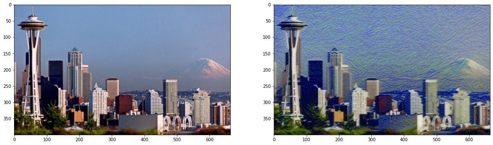
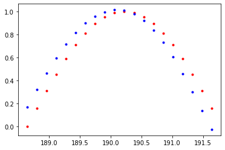

# Basic-Pytorch

This contains the implementaion of the basic pytorch Opertaions.
The mnist_pytorch file contains the way of how to create a basic Neural Network model using Pytorch(You can run this easily on colab)

All of the notebooks are created in google colab.

The style transfer can help you to transfer the style of one image to another. This is how it looks

I trained it for a very short time about 2000 epochs . You can train for longer and get bettter results.

The sine wave generated using RNN and Pytorch.
You can see the difference between the two images

